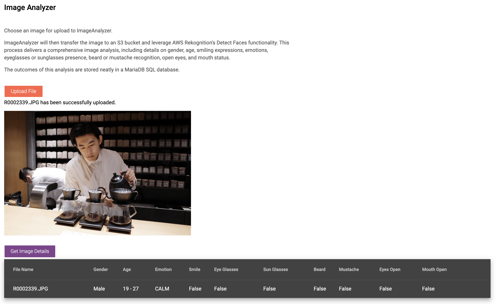
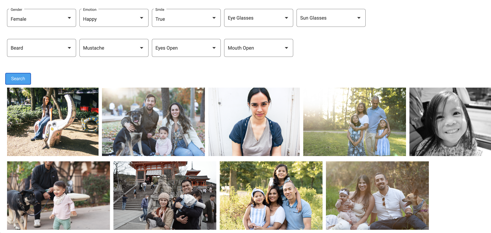

# ImageAnalyzer
Image Analyzer does facial analysis on photos and returns to the user details about concerning the person's gender, age, emotion, smile, glasses or sunglasses, beard or mustache, or if their eyes or mouth are open.

# How It Works
The user will upload an image from the Angular frontend and it will be stored in a AWS S3 bucket which will trigger a AWS Lambda function that will pass on the image data to AWS Rekognition FaceDetail API to do the image analysis. This data is then persisted in a AWS RDS SQL database.

The user is also able to query this database from the frontend to find all images that match a certain search criteria. 

Example: "Find all images that have a 5 year old girl smiling with her mouth open"
Example: "Find all images where everyone has their eyes open and are smiling"

# Technologies Used
* AWS Rekognition
* AWS Lambda
* AWS S3
* AWS RDS
* AWS EC2
* Angular

# Screenshots

